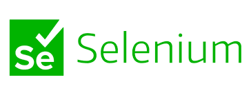

# Selenium Jenkins Automation 🚀

<!-- Local logos stored in the `images` folder -->
&nbsp;&nbsp;&nbsp;&nbsp;&nbsp;&nbsp;&nbsp;&nbsp;&nbsp;&nbsp;&nbsp;&nbsp;&nbsp;&nbsp;&nbsp;&nbsp;&nbsp;

This repository contains example Java code showing how to use **Selenium WebDriver** with **Jenkins** for automation testing. It demonstrates common Selenium operations such as searching items on Amazon, handling pop‑ups, managing browser waits, and taking screenshots.

## Features
- Simple Maven project structure
- Sample classes under `src/main/java/sample` covering different Selenium techniques
- Automated accessibility testing using axe-core integrated with Selenium WebDriver. It validates WCAG 2.1 A & AA compliance and fails the test suite on any serious or critical violations. User 'src/test/java/testing/accessibility/AccessibilitySampleTest.java'
- Ready to integrate with Jenkins pipelines for continuous testing

## Getting Started
1. Install Java and Maven.
2. Build the project:
   ```bash
   mvn package
   ```
3. Run the sample classes using your IDE or with `mvn exec`.

Happy testing! :sparkles:

## Visual Overview
Below is a simple diagram showing how Selenium tests integrate with Jenkins:

